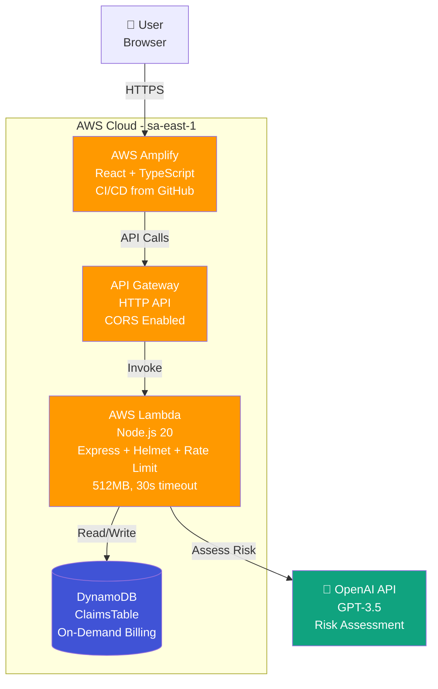

# Architecture Diagram

## AWS Deployment Architecture



## AWS Services

| Service | Purpose | Configuration |
|---------|---------|---------------|
| **AWS Amplify** | Frontend hosting & CI/CD | Auto-deploy from GitHub main branch |
| **API Gateway** | HTTP routing | HTTP API with CORS enabled |
| **Lambda** | Serverless compute | Node.js 20, 512MB RAM, 30s timeout, rate limiting |
| **DynamoDB** | NoSQL database | On-demand, GSI for userId queries |
| **OpenAI** | AI risk assessment | External service (GPT-3.5) |

## Security Layers

```
Internet
  ↓
API Gateway (CORS)
  ↓
Lambda (Helmet + Rate Limiting + Input Validation)
  ↓
DynamoDB (IAM Permissions)
  ↓
OpenAI (API Key Authentication)
```

## Request Flow

1. User submits claim via Amplify-hosted React app
2. API Gateway routes request to Lambda
3. Lambda validates input with Joi schemas and applies rate limiting
4. Lambda saves claim to DynamoDB
5. Lambda calls OpenAI for AI risk assessment
6. Lambda validates AI response (anti-hallucination)
7. Lambda updates claim in DynamoDB with assessment
8. Lambda logs structured data to CloudWatch
9. Response flows back through API Gateway to frontend

---

**For hexagonal architecture and code structure details, see main [README](../../README.md)**
