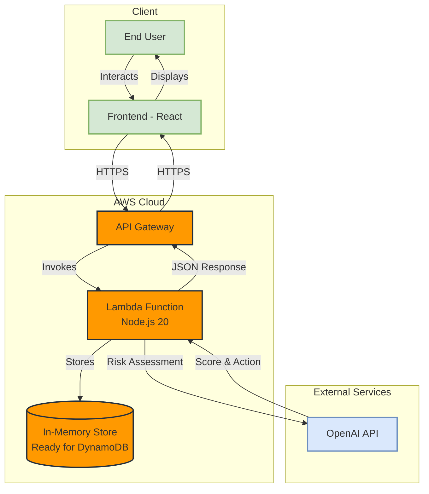
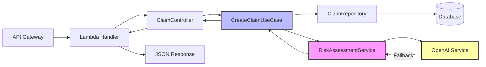

# Architecture Diagram

## System Architecture



## Hexagonal Architecture (Ports & Adapters)

### Layer Structure

```
src/
├── domain/              # Business logic & entities (Core)
│   ├── entities/
│   │   ├── Claim.ts
│   │   ├── User.ts
│   │   └── RiskAssessment.ts
│   ├── services/
│   │   └── RiskAssessmentService.ts    # Business rules
│   └── ports/
│       └── IRiskAssessmentService.ts   # Port for AI
│
├── application/         # Use cases (Application Layer)
│   ├── usecases/
│   │   ├── CreateClaimUseCase.ts
│   │   └── GetClaimByIdUseCase.ts
│   ├── ports/
│   │   └── IClaimRepository.ts         # Port for DB
│   └── validators/
│       └── createClaimValidator.ts
│
├── infrastructure/      # External adapters (Infrastructure)
│   ├── repositories/
│   │   ├── ClaimRepositoryMock.ts      # Current: In-Memory
│   │   └── ClaimRepositoryDynamoDB.ts  # Future: DynamoDB
│   ├── services/
│   │   └── OpenAIRiskAssessmentService.ts
│   └── http/
│       └── server.ts
│
└── interfaces/          # API adapters (Interface Layer)
    ├── controllers/
    │   └── ClaimController.ts
    └── routes/
        └── claimRoutes.ts
```

## Component Interaction



## Key Principles

1. **Dependency Inversion**: Core domain depends on nothing, all dependencies point inward
2. **Port & Adapters**: External systems communicate through defined interfaces (ports)
3. **Separation of Concerns**: Each layer has a single responsibility
4. **Testability**: Business logic isolated and easily testable

