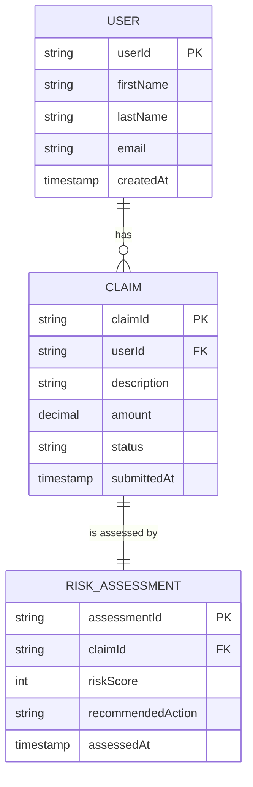

# Data Model

## Entity Relationship Diagram

## Entities Overview

### User
Stores user information for claim submission.

| Field | Type | Description |
|-------|------|-------------|
| userId | UUID | Primary key |
| firstName | VARCHAR(50) | User's first name |
| lastName | VARCHAR(50) | User's last name |
| email | VARCHAR(255) | User's email (unique) |
| createdAt | TIMESTAMP | Account creation date |

### Claim
Stores insurance claim details.

| Field | Type | Description |
|-------|------|-------------|
| claimId | UUID | Primary key |
| userId | UUID | Foreign key to User |
| description | TEXT | Claim description |
| amount | DECIMAL(10,2) | Claimed amount |
| status | ENUM | PENDING, APPROVE, MANUAL_REVIEW, REJECT |
| submittedAt | TIMESTAMP | Submission date |

### Risk Assessment
Stores AI-generated risk evaluation results.

| Field | Type | Description |
|-------|------|-------------|
| assessmentId | UUID | Primary key |
| claimId | UUID | Foreign key to Claim (unique) |
| riskScore | INTEGER | Risk score (0-100) |
| recommendedAction | ENUM | APPROVE, MANUAL_REVIEW, REJECT |
| assessedAt | TIMESTAMP | Assessment date |

## Relationships

- **User → Claim**: One-to-Many (One user can have multiple claims)
- **Claim → RiskAssessment**: One-to-One (Each claim has exactly one assessment)

## Status Enums

**Claim Status:**
- `PENDING` - Awaiting processing
- `APPROVE` - Automatically approved
- `MANUAL_REVIEW` - Requires human review
- `REJECT` - Automatically rejected

**Recommended Action:**
- `APPROVE` - Low risk (score < 30)
- `MANUAL_REVIEW` - Medium risk (score 30-69)
- `REJECT` - High risk (score ≥ 70)
