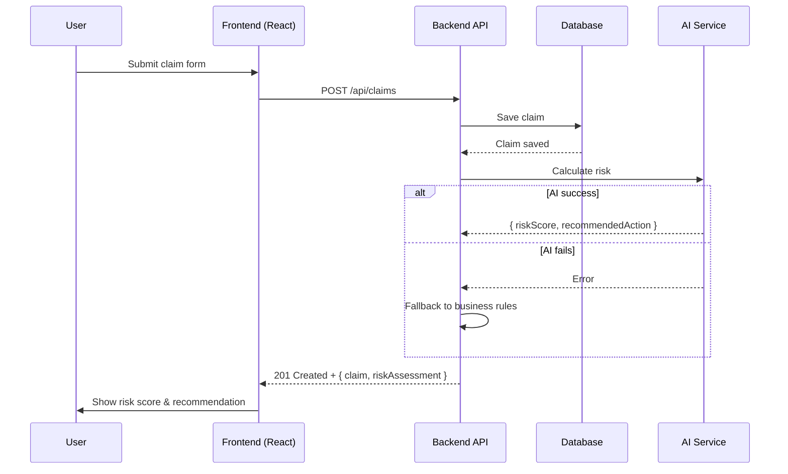

# Sequence Diagram

## Claim Submission Flow

```mermaid
sequenceDiagram
    participant User
    participant Frontend as Frontend (React)
    participant Backend as Backend API
    participant DB as Database
    participant AI as AI Service

    User->>Frontend: Submit claim form
    Frontend->>Backend: POST /api/claims
    
    Backend->>DB: Save claim
    DB-->>Backend: Claim saved
    
    Backend->>AI: Calculate risk
    
    alt AI success
        AI-->>Backend: { riskScore, recommendedAction }
    else AI fails
        AI-->>Backend: Error
        Backend->>Backend: Fallback to business rules
    end
    
    Backend-->>Frontend: 201 Created + { claim, riskAssessment }
    Frontend->>User: Show risk score & recommendation
```
