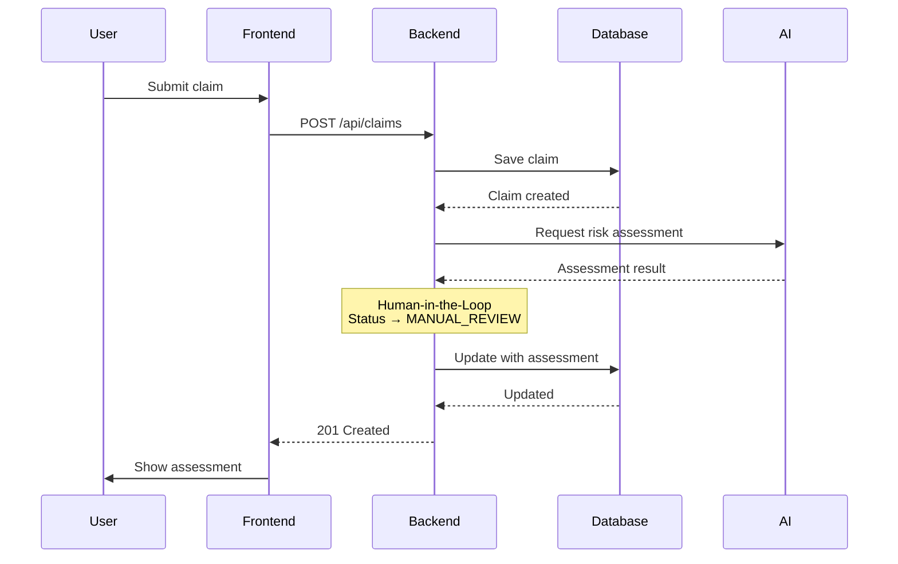

# Sequence Diagram

## Claim Submission Flow

## Key Concepts

### Human-in-the-Loop Safety Pattern
- AI provides recommendation (APPROVE, REJECT, or MANUAL_REVIEW)
- All claims automatically set to `MANUAL_REVIEW` status
- Human decision required before final approval/rejection
- Prevents AI hallucination from auto-approving/rejecting claims

### Assessment Components
- **riskScore**: 0-100 numerical risk level
- **recommendedAction**: AI suggestion (APPROVE | MANUAL_REVIEW | REJECT)
- **category**: Claim type (AUTO, HEALTH, HOME, LIFE, PROPERTY, TRAVEL, OTHER)
- **reasoning**: AI explanation for the assessment

## Error Handling

If AI service fails:
- Backend returns `502 Bad Gateway` error
- Frontend displays user-friendly error message
- No fallback to business rules (ensures consistent AI-powered assessment)
- Client can retry the request
