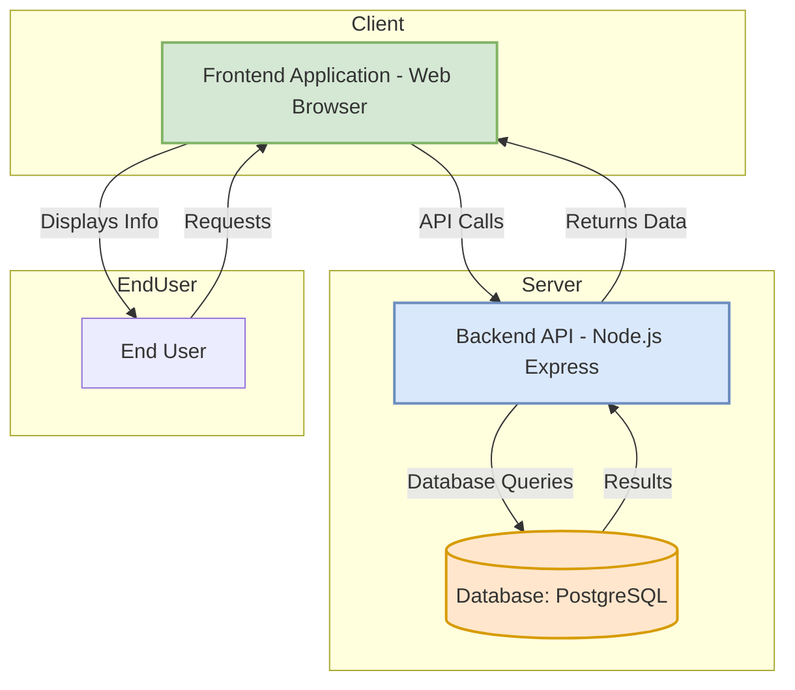
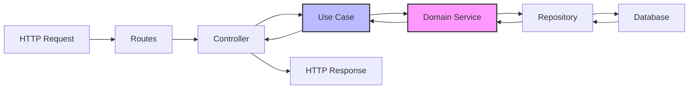

# Architecture Diagram

## System Architecture



## Hexagonal Architecture (Ports & Adapters)

### Layer Structure

```
src/
├── domain/              # Business logic & entities (Core)
│   ├── entities/
│   │   ├── Claim.ts
│   │   ├── User.ts
│   │   └── RiskAssessment.ts
│   ├── value-objects/
│   └── services/
│       └── RiskAssessmentService.ts    # AI Logic
│
├── application/         # Use cases (Application Layer)
│   └── usecases/
│       ├── CreateClaimUseCase.ts
│       ├── GetClaimUseCase.ts
│       └── ListClaimsUseCase.ts
│
├── infrastructure/      # External adapters (Infrastructure)
│   ├── database/
│   │   ├── models/
│   │   └── repositories/
│   └── config/
│       └── database.config.ts
│
└── interfaces/          # API adapters (Interface Layer)
    ├── controllers/
    │   └── ClaimController.ts
    ├── routes/
    │   └── claimRoutes.ts
    └── middleware/
        ├── errorHandler.ts
        └── validator.ts
```

## Component Interaction



## Key Principles

1. **Dependency Inversion**: Core domain depends on nothing, all dependencies point inward
2. **Port & Adapters**: External systems communicate through defined interfaces (ports)
3. **Separation of Concerns**: Each layer has a single responsibility
4. **Testability**: Business logic isolated and easily testable

