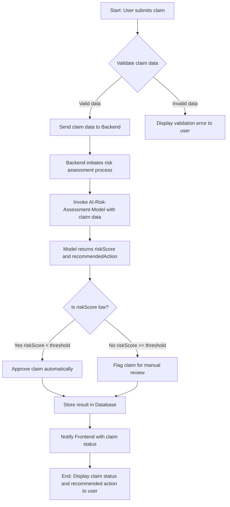
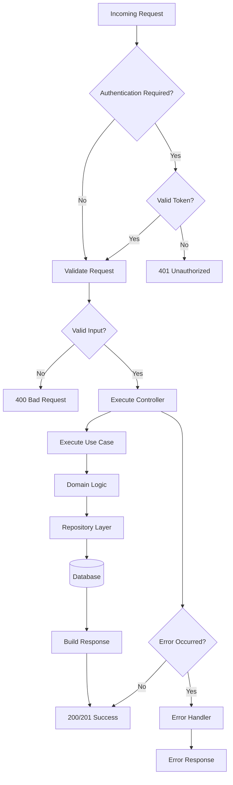
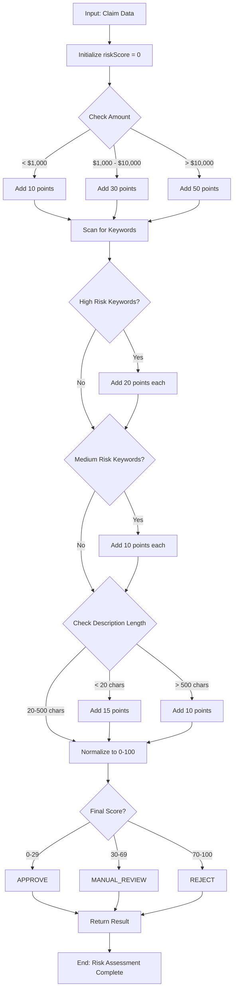
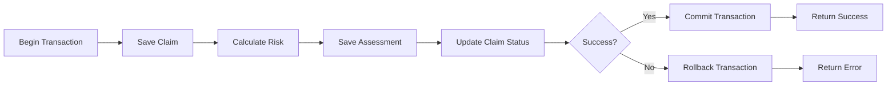

# Flow Diagram

## Risk Assessment Process Flow

```mermaid
graph TD
    A[Start: User submits claim] --> B{Validate claim data};

    B -- Valid data --> C[Send claim data to Backend];
    B -- Invalid data --> D[Display validation error to user];

    C --> E[Backend initiates risk assessment process];
    E --> F[Invoke AI-Risk-Assessment-Model with claim data];
    F --> G[Model returns riskScore and recommendedAction];
    G --> H{Is riskScore low?};

    H -- Yes riskScore < threshold --> I[Approve claim automatically];
    H -- No riskScore >= threshold --> J[Flag claim for manual review];

    I --> K[Store result in Database];
    J --> K;

    K --> L[Notify Frontend with claim status];
    L --> M[End: Display claim status and recommended action to user];
```

## API Request Flow

```mermaid
graph TD
    Start[Incoming Request] --> Auth{Authentication Required?}
    Auth -->|No| Validate[Validate Request]
    Auth -->|Yes| CheckAuth{Valid Token?}
    CheckAuth -->|No| Unauthorized[401 Unauthorized]
    CheckAuth -->|Yes| Validate
    
    Validate --> ValidCheck{Valid Input?}
    ValidCheck -->|No| BadRequest[400 Bad Request]
    ValidCheck -->|Yes| Controller[Execute Controller]
    
    Controller --> UseCase[Execute Use Case]
    UseCase --> Domain[Domain Logic]
    Domain --> Repo[Repository Layer]
    Repo --> DB[(Database)]
    
    DB --> Response[Build Response]
    Response --> Success[200/201 Success]
    
    Controller --> Error{Error Occurred?}
    Error -->|Yes| ErrorHandler[Error Handler]
    ErrorHandler --> ErrorResponse[Error Response]
    Error -->|No| Success
```

## Risk Score Calculation Flow

```mermaid
graph TD
    Start[Input: Claim Data] --> Init[Initialize riskScore = 0]
    
    Init --> Amount{Check Amount}
    Amount -->|< $1,000| AddLow[Add 10 points]
    Amount -->|$1,000 - $10,000| AddMedium[Add 30 points]
    Amount -->|> $10,000| AddHigh[Add 50 points]
    
    AddLow --> Keywords
    AddMedium --> Keywords
    AddHigh --> Keywords
    
    Keywords[Scan for Keywords] --> HighRisk{High Risk Keywords?}
    HighRisk -->|Yes| AddHighRisk[Add 20 points each]
    HighRisk -->|No| MediumRisk
    
    AddHighRisk --> MediumRisk{Medium Risk Keywords?}
    MediumRisk -->|Yes| AddMediumRisk[Add 10 points each]
    MediumRisk -->|No| Length
    
    AddMediumRisk --> Length{Check Description Length}
    Length -->|< 20 chars| AddShort[Add 15 points]
    Length -->|> 500 chars| AddLong[Add 10 points]
    Length -->|20-500 chars| Normalize
    
    AddShort --> Normalize[Normalize to 0-100]
    AddLong --> Normalize
    
    Normalize --> Decision{Final Score?}
    Decision -->|0-29| Approve[APPROVE]
    Decision -->|30-69| Manual[MANUAL_REVIEW]
    Decision -->|70-100| Reject[REJECT]
    
    Approve --> Return[Return Result]
    Manual --> Return
    Reject --> Return
    
    Return --> End[End: Risk Assessment Complete]
```

## Database Transaction Flow

```mermaid
graph LR
    A[Begin Transaction] --> B[Save Claim]
    B --> C[Calculate Risk]
    C --> D[Save Assessment]
    D --> E[Update Claim Status]
    E --> F{Success?}
    F -->|Yes| G[Commit Transaction]
    F -->|No| H[Rollback Transaction]
    G --> I[Return Success]
    H --> J[Return Error]
```

