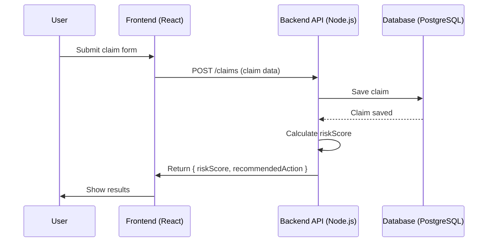
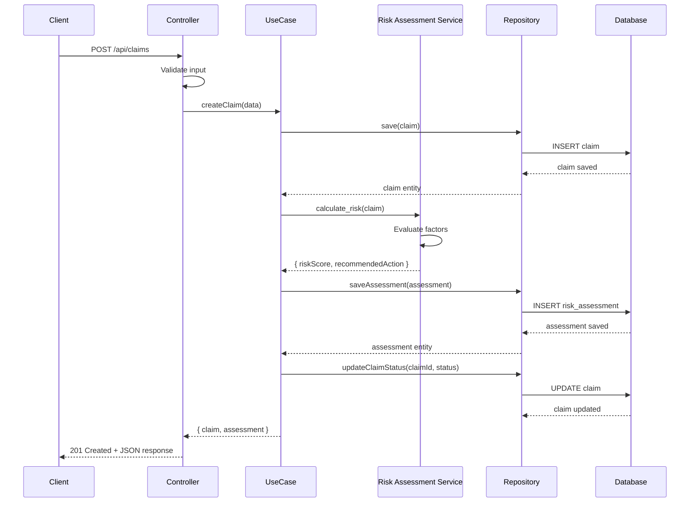
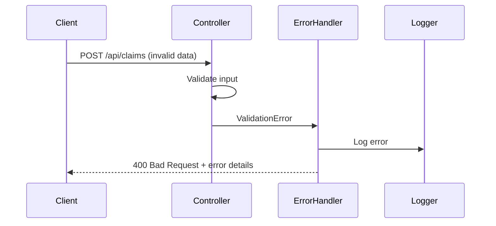
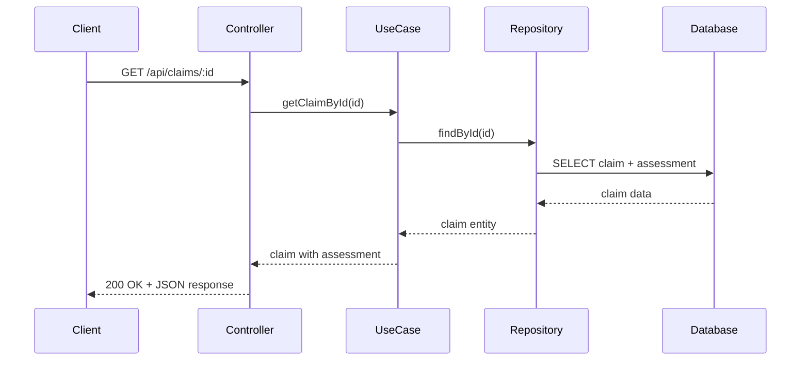

# Sequence Diagram

## Claim Submission Flow

```mermaid
sequenceDiagram
    participant User
    participant Frontend as Frontend (React)
    participant Backend as Backend API (Node.js)
    participant DB as Database (PostgreSQL)

    User->>Frontend: Submit claim form
    Frontend->>Backend: POST /claims (claim data)
    Backend->>DB: Save claim
    DB-->>Backend: Claim saved
    Backend->>Backend: Calculate riskScore
    Backend->>Frontend: Return { riskScore, recommendedAction }
    Frontend->>User: Show results
```

## Detailed Backend Flow

```mermaid
sequenceDiagram
    participant Client
    participant Controller
    participant UseCase
    participant DomainService as Risk Assessment Service
    participant Repository
    participant Database

    Client->>Controller: POST /api/claims
    Controller->>Controller: Validate input
    Controller->>UseCase: createClaim(data)
    UseCase->>Repository: save(claim)
    Repository->>Database: INSERT claim
    Database-->>Repository: claim saved
    Repository-->>UseCase: claim entity
    
    UseCase->>DomainService: calculate_risk(claim)
    DomainService->>DomainService: Evaluate factors
    DomainService-->>UseCase: { riskScore, recommendedAction }
    
    UseCase->>Repository: saveAssessment(assessment)
    Repository->>Database: INSERT risk_assessment
    Database-->>Repository: assessment saved
    Repository-->>UseCase: assessment entity
    
    UseCase->>Repository: updateClaimStatus(claimId, status)
    Repository->>Database: UPDATE claim
    Database-->>Repository: claim updated
    
    UseCase-->>Controller: { claim, assessment }
    Controller-->>Client: 201 Created + JSON response
```

## Error Handling Flow

```mermaid
sequenceDiagram
    participant Client
    participant Controller
    participant ErrorHandler
    participant Logger

    Client->>Controller: POST /api/claims (invalid data)
    Controller->>Controller: Validate input
    Controller->>ErrorHandler: ValidationError
    ErrorHandler->>Logger: Log error
    ErrorHandler-->>Client: 400 Bad Request + error details
```

## Get Claim Flow

```mermaid
sequenceDiagram
    participant Client
    participant Controller
    participant UseCase
    participant Repository
    participant Database

    Client->>Controller: GET /api/claims/:id
    Controller->>UseCase: getClaimById(id)
    UseCase->>Repository: findById(id)
    Repository->>Database: SELECT claim + assessment
    Database-->>Repository: claim data
    Repository-->>UseCase: claim entity
    UseCase-->>Controller: claim with assessment
    Controller-->>Client: 200 OK + JSON response
```

